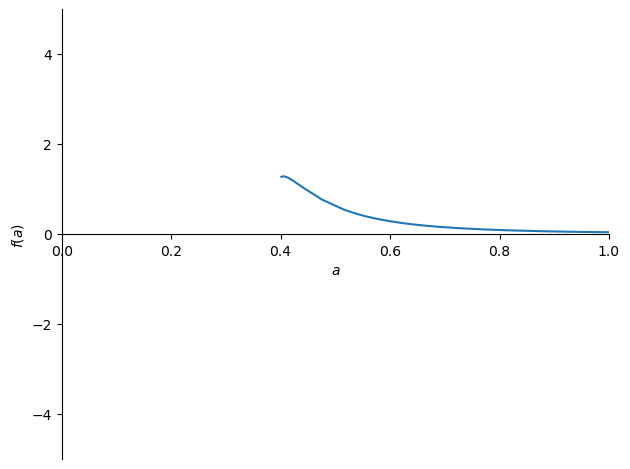
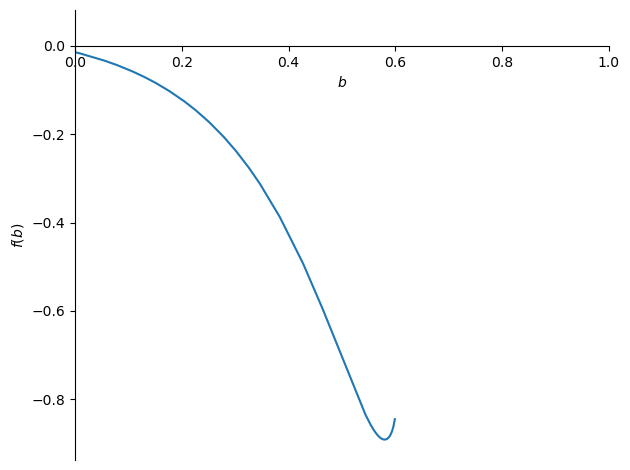
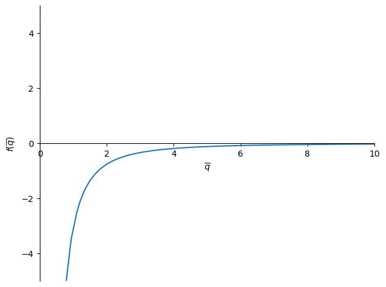
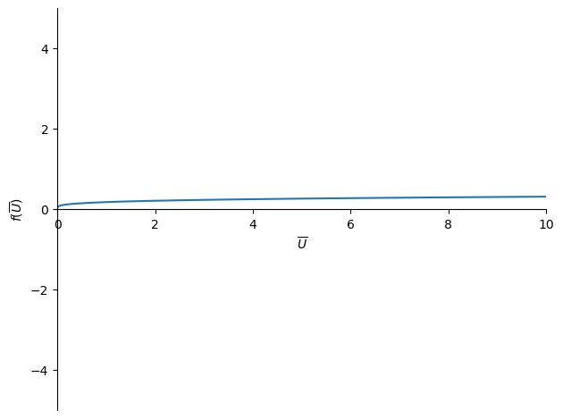
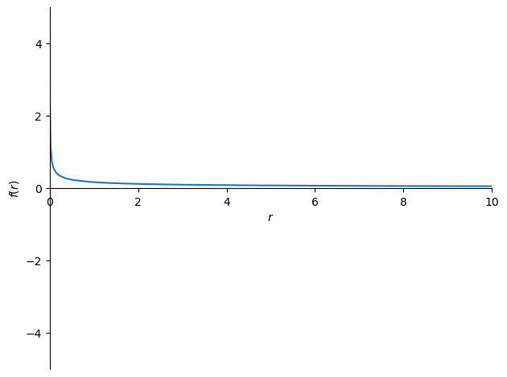
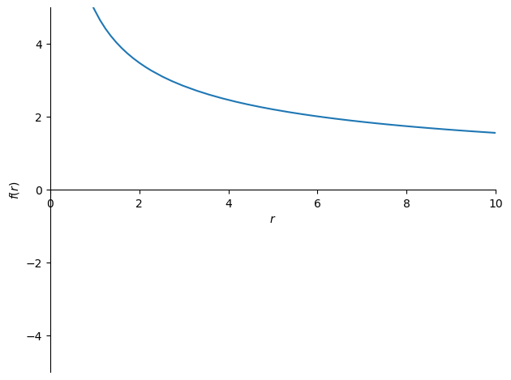
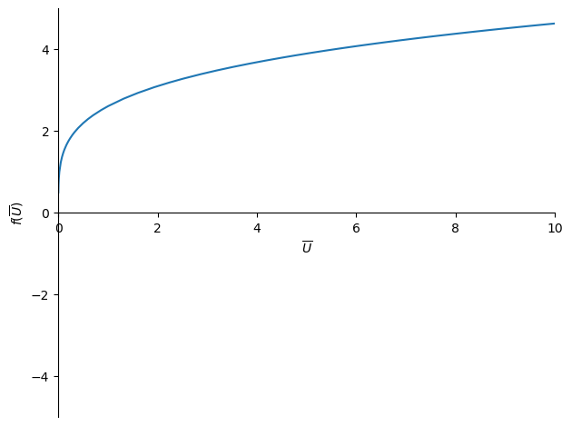

# Modeling Orphan Drug (Rare Disease) Companies Expenditure Minimization Problem


```python
#Importing Necessary Packages
# import all functions from python labrary: sympy
from sympy import *
# set sympy output to print pretty math expressions
init_printing()
```

# Table of Contents:
### A. [Introduction](#introduction)
### B. [Model Setup](#setup)
##### 1.[Variables](#variables)
##### 2.[Assumptions - Brief](#assumptionsA)
##### 3.[Rationale behind the model - breaking it down](#rationaleA)
##### 4.[Putting it back together](#rationaleB)
##### 5.[Assumptions Continued](#assumptionsB)
### C. [Sympy Analysis](#sympy)
##### 1. [FOCs, Lagrangian, optimal choices](#focs)
##### 2. [Visual Components](#visuals)
##### 3. [Comparative statics](#statics)
### D. [Conclusion and Discussion](#conclusion)
##### 1. [Optimal Choices](#choices)
##### 2. [Comparative Statics](#compare)
##### 3. [Model Limitations](#limits)
##### 4. [Extensions](#Extensions)
### E. [AI Memo and References](#ref)

## Introduction <a class="anchor" id="introduction"></a>

As a biochemistry and economics double major I am always fascinated by the places these two areas of study intersect. I have found myself interested in pharmacaeuticals and biotech as they are deeply intertwined in those sectors. In deepening my interests I have learned about rare-disease companies, sometimes referred to as Orphan Drug companies. I was immediately struck by these companies because they are in a unique position from their small market size and inelasticity of their product. I wondered how they operated, and what sort of tradeoffs they were faced with, primarily how did they balance such high costs and imposing them on small numbers of vulnerable, and desparate customers. While reading further about these companies I saw they often were under fire from the public for price gauging, and being harmful to the lives of patients by imposing incredible financial burdens on them.

This made me wonder - how could these companies account for the harm created by the pricing of their drugs when making decisions for their companies? I decided to approach this through an expenditure minimization model because I wanted the angle to be most beneficial towards patient outcomes. I wanted to know what was the smallest amount companies could spend while also reaching a treatment that provides utility to the patient, how would their investment recoupment impact the utility of the drug? I wanted to create a model that balanced R&D advancements and harms put on the patients.

So my research question became: How do I model rare-drug companies expenditure minimization problem in a way that has a focus on harms placed on patients from pricing and development. 


## Model Setup <a class="anchor" id="setup"></a>
\begin{align} 
& \underset{F,p_{d}}{min} = p_{d}\overline{q} + F\\
& s.t \quad \frac{(p_{d}F\overline{q})^{\alpha}}{(rp_{d}\overline{q})^{\beta}} = \overline{U}\\\\
&  \mathbb{L} =  \overline{q}p_{d} + F + {\lambda}(\overline{U} - \frac{(F\overline{q}p_{d})^a}{(\overline{q}p_{d}r)^b})
\end{align}

### 1. Variables  <a class="anchor" id="variables"></a>

\begin{align}
& p_{d} = \text{marginal cost to produce drug,} \quad F =\text{R\&D investment,} \quad q = \text{number of patients / customers,}\\
& \overline{U} = \text{utility requirement for drug,} \quad r = \text{revenue coefficient,} \quad {\alpha} = \text{effectiveness of R\&D,} \quad {\beta} = \text{sensitivity to pricing harms}
\end{align}

### 2. Assumptions - Brief <a class="anchor" id="asssumeptionsA"></a>

\begin{align}               
 & p_{d} > 0, \quad \overline{q} > 0, \quad F > 0, \\
 & {\alpha} > 0, \quad {\beta} > 0, \quad r > 1, \quad \overline{U} > 0\\
 & {\alpha} + {\beta} = 1, {\alpha} > {\beta}
\end{align}

### 3. Rationale Behind the Model - Breaking it down <a class="anchor" id="rationaleA"></a>

\begin{align}
& \text{The objective function: } \underset{F,p_{d}}{min} = p_{d}\overline{q} + F\text{, represents that the cost incurred by a firm is generated by their cost to produce the drug}\\
& \text{multiplied by the number of patients recieving the drug, and their research and development investments.}\\
& \\
& \text{The constraint AKA research function: } \frac{(p_{d}F\overline{q})^{\alpha}}{(rp_{d}q)^{\beta}} = \overline{U} \text{, represents that there are tradeoffs between advancements: } (F\overline{q})^{\alpha} \text{, and harms: } (rp_{d}q)^{\beta},\\
& \text{that have to be combined in a way that reaches the desired utility of the drug: } \overline{U}\\
&\\ 
& \text{Advancements :} (p_{d}F\overline{q})^{\alpha} \text{, represents how R\&D investments and production cost are distributed to patients by increasing the utility of the drug they} \\
& \text{receive, and will be associated with some level of effectiveness that determines how useful the R\&D investments have been distributed to patients, } {\alpha}\\
&\\ 
& \text{Harms : } (rp_{d}q)^{\beta} \text{ represents how the pricing of drugs is associated with some amount of revenue, r, gained per drug sold to each patient to}\\
&\text{recoup investments, } p_{d}\overline{q} \text{ and that pricing decreases the utility of the drug by burdening the patient which may decrease their health in other aspects.}\\
&\text{This is associated with some sensitivity to how harmful these factors will be given a certain drug, } {\beta} 
\end{align}

### 4. Putting it back together <a class="anchor" id="rationaleB"></a>
\begin{align}
&\text{This model tells the story that rare drug companies are selling to a fixed population of patients, and incur costs from producing the drug and investing in}\\ 
&\text{its development.}\\\\
&\text{Additionally, they are tasked with reaching a certain utility requirement for the drug, and faced with tradeoffs by their decisions in R\&D investments}\\
&\text{and harms generated by investment recoupment in each sale to patients}\\
\\
\end{align}

### 5. Assumptions continued <a id="assumptionsB"></a>

\begin{align}
&\text{We assume the decision maker is rational and seeking the optimal outcome}\\
&\text{We assume the firm has exlusivity on their market}\\
&\text{We assume F to be the net price a firm will spend on R\&D, incorporating benefits from tax incentives already}\\
&\text{We assume, } p_{d} \; \text{and } F \text{ to be > 0 because in this model you cannot have negative expenditure}\\
&\text{We assume } \overline{q} \; \text{to be > 1 because the rare drug company cannot have less than 1 whole human being as a patient}\\
&\text{We assume } \overline{U} \; \text{to be > 0 because the drug must contribute to the patients well-being}\\
&\text{We assume } r \; \text{to be > 1 because the firm is recouping investment returns and must sell for more than the marginal cost of production}\\
&\text{We assume } {\alpha} + {\beta} \; \text{to both be between 0 and 1, and to add up to one, and for } {\beta} < {\alpha} \text{ because these values represent 100 percent of the firms}\\
& \text{decisions, so }{\alpha} \text{ would be percent of choices gone to advancement and } {\beta} \text{ would be percent of choices resulting in harm.}\\
&\text{In this we also assume the firm would not produce the drug unless more advancement is being created than harm.}
\end{align}

# C. Sympy Analysis <a class="anchor" id="sympy"></a>

## 1. FOCs, Lagrangian, and finding optimal choices <a class="anchor" id="focs"></a>


```python
#Defining symbols in the model for analysis by python

#Choice variables as symbols
F, p = symbols('F p_{d}', nonzero = True, positive = True)

#Fixed variables 
q, U  = symbols(r'\overline{q} \overline{U}', nonzero =True, positive = True)

#Coefficients and exponentials
a, b, r = symbols('a b r', nonzero = True, positive = True)

#Lagrangian symbols
lam  = symbols(r'{\lambda}', nonzero = True, positive = True)
```


```python
#Setting up the model 
#objective function 
obj = p*q + F

#utility constraint
utility = ((p*F*q)**a)/((r*p*q)**b) 

#Setting up the lagrangian

lagr = p*q + F + lam * (U - utility)
lagr
```


$\displaystyle F + \overline{q} p_{d} + {\lambda} \left(\overline{U} - \left(F \overline{q} p_{d}\right)^{a} \left(\overline{q} p_{d} r\right)^{- b}\right)$


```python
#Defining our FOCs
foc_F = diff(lagr, F)
foc_p = diff(lagr, p)
foc_lam = diff(lagr, lam)
```


```python
#Simplifying our FOCs
foc_F = foc_F.simplify()
foc_p = foc_p.simplify()
foc_lam = foc_lam.simplify()

```


```python
#Solving FOCs for F*, p*, and lam*
foc_sol = solve( ( diff(lagr,F), diff(lagr,p), diff(lagr,lam) ), [F,p,lam])
foc_sol
```


$\displaystyle \left[ \left( \frac{a^{\frac{a}{2 a - b}} \left(\overline{U} \overline{q}^{b} r^{b} \left(a^{- \frac{a}{2 a - b}} \left(\overline{U}^{\frac{1}{a}} \overline{q}^{\frac{- 2 a + b}{a}} r^{\frac{b}{a}} \left(a - b\right)\right)^{\frac{a}{2 a - b}}\right)^{b}\right)^{\frac{1}{a}} \left(\overline{U}^{\frac{1}{a}} \overline{q}^{\frac{- 2 a + b}{a}} r^{\frac{b}{a}} \left(a - b\right)\right)^{- \frac{a}{2 a - b}}}{\overline{q}}, \  \left(\frac{\overline{U}^{\frac{1}{a}} \overline{q}^{\frac{- 2 a + b}{a}} r^{\frac{b}{a}} \left(a - b\right)}{a}\right)^{\frac{a}{2 a - b}}, \  \frac{\overline{U}^{\frac{1 - a}{a}} r^{\frac{b}{a}} \left(\overline{q} a^{- \frac{a}{2 a - b}} \left(\overline{U}^{\frac{1}{a}} \overline{q}^{\frac{- 2 a + b}{a}} r^{\frac{b}{a}} \left(a - b\right)\right)^{\frac{a}{2 a - b}}\right)^{\frac{- a + b}{a}}}{a}\right)\right]$


```python
Fstar = simplify(sol_list[0][0])
Fstar
```


$\displaystyle \frac{a^{\frac{a}{2 a - b}} \left(\overline{U} \overline{q}^{b} r^{b} \left(a^{- \frac{a}{2 a - b}} \left(\overline{U}^{\frac{1}{a}} \overline{q}^{\frac{- 2 a + b}{a}} r^{\frac{b}{a}} \left(a - b\right)\right)^{\frac{a}{2 a - b}}\right)^{b}\right)^{\frac{1}{a}} \left(\overline{U}^{\frac{1}{a}} \overline{q}^{\frac{- 2 a + b}{a}} r^{\frac{b}{a}} \left(a - b\right)\right)^{- \frac{a}{2 a - b}}}{\overline{q}}$


```python
pstar = simplify(sol_list[0][1])
pstar
```


$\displaystyle \left(\frac{\overline{U}^{\frac{1}{a}} \overline{q}^{\frac{- 2 a + b}{a}} r^{\frac{b}{a}} \left(a - b\right)}{a}\right)^{\frac{a}{2 a - b}}$


```python
#Creating the cost function
C = (p*q + F).subs([(F,Fstar), (p,pstar)])
# simplify function does not work well here, but we can further simplify by hand
C.simplify()
```


$\displaystyle a^{- \frac{a}{2 a - b}} \left(\overline{U}^{\frac{1}{a}} r^{\frac{b}{a}} \left(a - b\right)\right)^{- \frac{a}{2 a - b}} \left(a^{\frac{2 a}{2 a - b}} \left(\overline{U} \left(\overline{q}^{- \frac{2 a}{2 a - b}} a^{- \frac{a}{2 a - b}} \left(\overline{U}^{\frac{1}{a}} \overline{q}^{\frac{b}{a}} r^{\frac{b}{a}} \left(a - b\right)\right)^{\frac{a}{2 a - b}}\right)^{b}\right)^{\frac{1}{a}} \left(\overline{q} r\right)^{\frac{b}{a}} + \left(\overline{U}^{\frac{1}{a}} r^{\frac{b}{a}} \left(a - b\right)\right)^{\frac{2 a}{2 a - b}}\right)$


## 2. Visual components  - See other attached Jupyter notebook <a class="anchor" id="visuals"></a>

## 3. Comparative statics <a class="anchor" id="statics"></a>


```python
#Calculating solution for pd* diff a
p_diff_a = simplify(pstar.diff(a))
p_diff_a
```


$\displaystyle \frac{a^{- \frac{a}{2 a - b}} \left(\overline{U}^{\frac{1}{a}} r^{\frac{b}{a}} \left(a - b\right)\right)^{\frac{a}{2 a - b}} \left(- a b \log{\left(a - b \right)} + 2 a b + b^{2} \log{\left(a - b \right)} - b^{2} + \log{\left(\overline{U}^{- 2 a + 2 b} a^{b \left(a - b\right)} r^{2 b \left(- a + b\right)} \right)}\right)}{\overline{q} \left(4 a^{3} - 8 a^{2} b + 5 a b^{2} - b^{3}\right)}$


```python
#Plotting p_diff_a to see if the values are positive or not
param_valuesA = {q: 5, U: 1, b: 0.4, r: 2.5}
plot(p_diff_a.subs(param_valuesA), xlim = [0, 1], ylim = [-5, 5])
```

    <string>:1: RuntimeWarning: invalid value encountered in scalar power


    

    


    <sympy.plotting.plot.Plot at 0x17d1f70b0>


```python
#Calculating solution for pd* diff b
p_diff_b = simplify(pstar.diff(b))
p_diff_b
```


$\displaystyle \frac{a^{\frac{- 3 a + b}{2 a - b} + 1} \left(\overline{U}^{\frac{1}{a}} \overline{q}^{\frac{- 2 a + b}{a}} r^{\frac{b}{a}} \left(a - b\right)\right)^{\frac{a}{2 a - b}} \left(a \left(a - b\right) \log{\left(\frac{\overline{U}^{\frac{1}{a}} \overline{q}^{\frac{- 2 a + b}{a}} r^{\frac{b}{a}} \left(a - b\right)}{a} \right)} + \left(- a + \log{\left(\left(\overline{q} r\right)^{a - b} \right)}\right) \left(2 a - b\right)\right)}{\left(a - b\right) \left(2 a - b\right)^{2}}$


```python
#Plotting p_diff_b to see if the values are positive or not
param_valuesB = {q: 5, U: 1, a: 0.6, r: 2.5}
plot(p_diff_b.subs(param_valuesB), xlim = [0, 1])
```

    <string>:1: RuntimeWarning: invalid value encountered in scalar power


    

    


    <sympy.plotting.plot.Plot at 0x280bf3020>


```python
#Calculating solution for pd* diff q
p_diff_q = simplify(pstar.diff(q))
p_diff_q
```


$\displaystyle - \frac{a^{- \frac{a}{2 a - b}} \left(\overline{U}^{\frac{1}{a}} \overline{q}^{- \frac{2 a - b}{a}} r^{\frac{b}{a}} \left(a - b\right)\right)^{\frac{a}{2 a - b}}}{\overline{q}}$


```python
#Plotting p_diff_q to see if the values are positive or not
param_valuesB = {b: 0.2, U: 5, a: 0.8, r: 2.5}
plot(p_diff_q.subs(param_valuesB), xlim = [0, 10], ylim = [-5, 5])
```


    

    


    <sympy.plotting.plot.Plot at 0x280e63410>


```python
#Calculating solution for pd* diff U
p_diff_U = simplify(pstar.diff(U))
p_diff_U
```


$\displaystyle \frac{a^{- \frac{a}{2 a - b}} \left(\overline{U}^{\frac{1}{a}} r^{\frac{b}{a}} \left(a - b\right)\right)^{\frac{a}{2 a - b}}}{\overline{U} \overline{q} \left(2 a - b\right)}$


```python
#Plotting p_diff_U to see if the values are positive or not
param_valuesU = {q: 5, b: 0.4, a: 0.6, r: 2.5}
plot(p_diff_U.subs(param_valuesU), xlim = [0, 10], ylim = [-5, 5])
```

    <string>:1: RuntimeWarning: invalid value encountered in scalar power


    

    


    <sympy.plotting.plot.Plot at 0x17d50a3c0>


```python
#Calculating solution for pd* diff r
p_diff_r = simplify(pstar.diff(r))
p_diff_r
```


$\displaystyle \frac{a^{- \frac{a}{2 a - b}} b \left(\overline{U}^{\frac{1}{a}} r^{\frac{b}{a}} \left(a - b\right)\right)^{\frac{a}{2 a - b}}}{\overline{q} r \left(2 a - b\right)}$


```python
#Plotting p_diff_r to see if values are > 0 
param_valuesR = {q: 10, U: 5, a: 0.6, b: 0.4}
plot(p_diff_r.subs(param_valuesR), xlim = [0, 10], ylim = [-5, 5])
```

    <string>:1: RuntimeWarning: invalid value encountered in scalar power


    

    


    <sympy.plotting.plot.Plot at 0x17d1c9c40>


### Comparative statics for R&D investment


```python
#Calculating solution for F* diff a 
F_diff_a = simplify(Fstar.diff(a))
F_diff_a
```


$\displaystyle \frac{\overline{U}^{- \frac{2}{a}} \left(\overline{U}^{3} \overline{q}^{b} r^{b} \left(a^{- \frac{a}{2 a - b}} \left(\overline{U}^{\frac{1}{a}} \overline{q}^{\frac{- 2 a + b}{a}} r^{\frac{b}{a}} \left(a - b\right)\right)^{\frac{a}{2 a - b}}\right)^{b}\right)^{\frac{1}{a}} \left(\overline{U}^{\frac{1}{a}} \overline{q}^{\frac{- 2 a + b}{a}} r^{\frac{b}{a}} \left(a - b\right)\right)^{- \frac{2 a}{2 a - b}} \left(a^{4} \left(a^{2} b \left(a^{3} \left(\overline{U}^{\frac{1}{a}} \overline{q}^{\frac{- 2 a + b}{a}} a r^{\frac{b}{a}} \left(a - b\right)\right)^{\frac{a}{2 a - b}} \left(- a b \left(a - b\right) \log{\left(\overline{U}^{\frac{1}{a}} \overline{q}^{\frac{- 2 a + b}{a}} r^{\frac{b}{a}} \left(a - b\right) \right)} + \left(2 a - b\right) \left(a^{2} - \log{\left(\overline{q}^{b \left(a - b\right)} \left(\overline{U} r^{b}\right)^{a - b} \right)}\right)\right) + a^{\frac{9 a - 4 b}{2 a - b}} \left(\overline{U}^{\frac{1}{a}} \overline{q}^{\frac{- 2 a + b}{a}} r^{\frac{b}{a}} \left(a - b\right)\right)^{\frac{a}{2 a - b}} \left(a - b\right) \left(- 2 a + b + \log{\left(a^{b} \right)}\right)\right) - a^{\frac{11 a - 5 b}{2 a - b}} \left(\overline{U}^{\frac{1}{a}} \overline{q}^{\frac{- 2 a + b}{a}} r^{\frac{b}{a}} \left(a - b\right)\right)^{\frac{a}{2 a - b}} \left(a - b\right) \left(2 a - b\right)^{2} \log{\left(\overline{U} \left(\overline{q} a^{- \frac{a}{2 a - b}} r \left(\overline{U}^{\frac{1}{a}} \overline{q}^{\frac{- 2 a + b}{a}} r^{\frac{b}{a}} \left(a - b\right)\right)^{\frac{a}{2 a - b}}\right)^{b} \right)}\right) + a^{\frac{23 a - 11 b}{2 a - b}} \left(\overline{U}^{\frac{1}{a}} \overline{q}^{\frac{- 2 a + b}{a}} r^{\frac{b}{a}} \left(a - b\right)\right)^{\frac{a}{2 a - b}} \left(a - b\right) \left(2 a - b - \log{\left(a^{b} \right)}\right) + a^{3 + \frac{15 a - 7 b}{2 a - b}} \left(\overline{U}^{\frac{1}{a}} \overline{q}^{\frac{- 2 a + b}{a}} r^{\frac{b}{a}} \left(a - b\right)\right)^{\frac{a}{2 a - b}} \left(a b \left(a - b\right) \log{\left(\overline{U}^{\frac{1}{a}} \overline{q}^{\frac{- 2 a + b}{a}} r^{\frac{b}{a}} \left(a - b\right) \right)} + \left(2 a - b\right) \left(- a^{2} + \log{\left(\overline{q}^{b \left(a - b\right)} \left(\overline{U} r^{b}\right)^{a - b} \right)}\right)\right)\right)}{\overline{q} a^{11} \left(a - b\right) \left(2 a - b\right)^{2}}$


```python
#Sympy is unable to plot this solution so we will substitute in reasonable parameters and take the sign of that
param_values_FA = {a: 0.6, q: 10, U: 5, b: 0.4, r: 2.5}
sign(F_diff_a.subs(param_values_FA))
```


$\displaystyle -1$


```python
#Calculating solution for F* diff b
F_diff_b = simplify(Fstar.diff(b)) 
F_diff_b 
```


$\displaystyle \frac{\overline{U}^{- \frac{a + 2}{a}} \overline{q}^{- b - 3} r^{- \frac{b \left(a + 2\right)}{a}} \left(a^{- \frac{a}{2 a - b}} \left(\overline{U}^{\frac{1}{a}} \overline{q}^{\frac{- 2 a + b}{a}} r^{\frac{b}{a}} \left(a - b\right)\right)^{\frac{a}{2 a - b}}\right)^{- b} \left(\overline{U}^{\frac{1}{a}} \overline{q}^{\frac{- 2 a + b}{a}} r^{\frac{b}{a}} \left(a - b\right)\right)^{- \frac{2 a}{2 a - b}} \left(- \overline{U}^{\frac{a + 2}{a}} \overline{q}^{b + 2} a^{\frac{3 a - b}{2 a - b}} r^{\frac{b \left(a + 2\right)}{a}} \left(a^{- \frac{a}{2 a - b}} \left(\overline{U}^{\frac{1}{a}} \overline{q}^{\frac{- 2 a + b}{a}} r^{\frac{b}{a}} \left(a - b\right)\right)^{\frac{a}{2 a - b}}\right)^{b} \left(\overline{U} \overline{q}^{b} r^{b} \left(a^{- \frac{a}{2 a - b}} \left(\overline{U}^{\frac{1}{a}} \overline{q}^{\frac{- 2 a + b}{a}} r^{\frac{b}{a}} \left(a - b\right)\right)^{\frac{a}{2 a - b}}\right)^{b}\right)^{\frac{1}{a}} \left(\overline{U}^{\frac{1}{a}} \overline{q}^{\frac{- 2 a + b}{a}} r^{\frac{b}{a}} \left(a - b\right)\right)^{\frac{a}{2 a - b}} \left(a \left(a - b\right) \log{\left(\overline{U}^{\frac{1}{a}} \overline{q}^{\frac{- 2 a + b}{a}} r^{\frac{b}{a}} \left(a - b\right) \right)} + \left(- a + \log{\left(\overline{q}^{a - b} r^{a - b} \right)}\right) \left(2 a - b\right)\right) + \overline{U}^{1 + \frac{1}{a}} \overline{q}^{2} r^{\frac{2 b}{a}} \left(\overline{U}^{2} \overline{q}^{b} r^{b} \left(a^{- \frac{a}{2 a - b}} \left(\overline{U}^{\frac{1}{a}} \overline{q}^{\frac{- 2 a + b}{a}} r^{\frac{b}{a}} \left(a - b\right)\right)^{\frac{a}{2 a - b}}\right)^{b}\right)^{\frac{1}{a}} \left(\overline{q} a^{- \frac{a}{2 a - b}} r \left(\overline{U}^{\frac{1}{a}} \overline{q}^{\frac{- 2 a + b}{a}} r^{\frac{b}{a}} \left(a - b\right)\right)^{\frac{a}{2 a - b}}\right)^{b} \left(- b \left(a^{\frac{3 a - b}{2 a - b}} \left(\overline{U}^{\frac{1}{a}} \overline{q}^{\frac{- 2 a + b}{a}} r^{\frac{b}{a}} \left(a - b\right)\right)^{\frac{a}{2 a - b}} \log{\left(a^{a - b} \right)} + \left(\overline{U}^{\frac{1}{a}} \overline{q}^{\frac{- 2 a + b}{a}} a r^{\frac{b}{a}} \left(a - b\right)\right)^{\frac{a}{2 a - b}} \left(- a \left(a - b\right) \log{\left(\overline{U}^{\frac{1}{a}} \overline{q}^{\frac{- 2 a + b}{a}} r^{\frac{b}{a}} \left(a - b\right) \right)} + \left(a - \log{\left(\overline{q}^{a - b} r^{a - b} \right)}\right) \left(2 a - b\right)\right)\right) + \left(\overline{U}^{\frac{1}{a}} \overline{q}^{\frac{- 2 a + b}{a}} a r^{\frac{b}{a}} \left(a - b\right)\right)^{\frac{a}{2 a - b}} \left(a - b\right) \left(2 a - b\right)^{2} \log{\left(a^{- \frac{a}{2 a - b}} \left(\overline{U}^{\frac{1}{a}} \overline{q}^{\frac{- 2 a + b}{a}} r^{\frac{b}{a}} \left(a - b\right)\right)^{\frac{a}{2 a - b}} \right)} + \left(\overline{U}^{\frac{1}{a}} \overline{q}^{\frac{- 2 a + b}{a}} a r^{\frac{b}{a}} \left(a - b\right)\right)^{\frac{a}{2 a - b}} \log{\left(\left(\overline{q} r\right)^{\left(a - b\right) \left(2 a - b\right)^{2}} \right)}\right) + a^{\frac{5 a - 2 b}{2 a - b}} \left(a^{- \frac{a}{2 a - b}} \left(\overline{U}^{\frac{1}{a}} \overline{q}^{\frac{- 2 a + b}{a}} r^{\frac{b}{a}} \left(a - b\right)\right)^{\frac{a}{2 a - b}}\right)^{b} \left(\overline{U} \overline{q}^{b} r^{b} \left(a^{- \frac{a}{2 a - b}} \left(\overline{U}^{\frac{1}{a}} \overline{q}^{\frac{- 2 a + b}{a}} r^{\frac{b}{a}} \left(a - b\right)\right)^{\frac{a}{2 a - b}}\right)^{b}\right)^{\frac{1}{a}} \left(\overline{U}^{\frac{1}{a}} \overline{q}^{\frac{- 2 a + b}{a}} r^{\frac{b}{a}} \left(a - b\right)\right)^{\frac{a}{2 a - b}} \log{\left(a^{\overline{U}^{\frac{a + 2}{a}} \overline{q}^{b + 2} r^{\frac{b \left(a + 2\right)}{a}} \left(a - b\right)} \right)}\right)}{a \left(a - b\right) \left(2 a - b\right)^{2}}$


```python
#Sympy is unable to plot this solution so we will substitute in reasonable parameters and take the sign of that
param_values_FB = {a: 0.6, q: 10, U: 5, b: 0.4, r: 2}
sign(F_diff_b.subs(param_values_FB))
```


$\displaystyle 1$


```python
#Calculating solution for F* diff r
F_diff_R = simplify(Fstar.diff(r))
F_diff_R
```


$\displaystyle \frac{\overline{q}^{\frac{b}{a}} b r^{-1 + \frac{b}{a}} \left(\overline{U} \left(\overline{q}^{- \frac{2 a}{2 a - b}} a^{- \frac{a}{2 a - b}} \left(\overline{U}^{\frac{1}{a}} \overline{q}^{\frac{b}{a}} r^{\frac{b}{a}} \left(a - b\right)\right)^{\frac{a}{2 a - b}}\right)^{b}\right)^{\frac{1}{a}} \left(\overline{U}^{\frac{1}{a}} r^{\frac{b}{a}} \left(a - b\right)\right)^{- \frac{2 a}{2 a - b}} \left(\overline{U}^{\frac{1}{a}} a r^{\frac{b}{a}} \left(a - b\right)\right)^{\frac{a}{2 a - b}}}{2 a - b}$


```python
param_valuesFR = {a: 0.6, q: 10, U: 5, b: 0.4}
plot(F_diff_R.subs(param_valuesFR), xlim = [0,10], ylim = [-5, 5])
```

    <string>:1: RuntimeWarning: invalid value encountered in scalar power


    

    


    <sympy.plotting.plot.Plot at 0x280238830>


```python
#Calculating solution for F* diff U 
F_diff_U = simplify(Fstar.diff(U))
F_diff_U
```


$\displaystyle \frac{\overline{U}^{-1 + \frac{1}{a}} \left(\overline{q} r\right)^{\frac{b}{a}} \left(\overline{U}^{\frac{1}{a}} r^{\frac{b}{a}} \left(a - b\right)\right)^{- \frac{2 a}{2 a - b}} \left(\overline{U}^{\frac{1}{a}} a r^{\frac{b}{a}} \left(a - b\right)\right)^{\frac{a}{2 a - b}} \left(\left(\overline{q}^{- \frac{2 a}{2 a - b}} a^{- \frac{a}{2 a - b}} \left(\overline{U}^{\frac{1}{a}} \overline{q}^{\frac{b}{a}} r^{\frac{b}{a}} \left(a - b\right)\right)^{\frac{a}{2 a - b}}\right)^{b}\right)^{\frac{1}{a}}}{2 a - b}$


```python
param_valuesFU = {a: 0.6, q: 10, r: 2.5, b: 0.4}
plot(F_diff_U.subs(param_valuesFU), xlim = [0,10], ylim = [-5, 5])
```

    <string>:1: RuntimeWarning: invalid value encountered in scalar power


    

    


    <sympy.plotting.plot.Plot at 0x283c7cc80>


```python
F_diff_q = simplify(Fstar.diff(q))
F_diff_q
```


$\displaystyle 0$


# D. Conclusion and Discussion <a class="anchor" id="conclusion"></a>

## 1. Optimal Choices <a class="anchor" id="choices"></a>
---
####  F*

F* defined in the line labeled 1033, and is a very long complex equation. To break it down we will look at the numerator and denominator separately, then weight them against each other to get a better picture. I will examine the dominating portions of the equations for simplicity. All parts mentioned are multiplied together, or exponentiated, which will be specified. 


The Numerator: 

The first terms $a^{a/(2a-b)}$ ensure that more effective research and production (higher ${\alpha}$) raises the impact that R&D will have on reaching the utility goals. 

The following term multiplied by the previous $\overline{U}^{b}*\overline{q}^{b}*r^{b}$ demonstrates the total utility goal considering the desired drug, number of patients, and the revenue factor. By exponentiating this with the harms value, ${\beta}$ ,it also depends on the weight of harms in our model.

The following term is nested, and identical to the denominator, discussed below, but with two key differences: it is exponentiated to ${\beta}$, and divided by our first term, $a^{a/(2a-b)}$. This serves the purpose to demonstrate that F* will increase with a higher utility target, and by that our advancements dominate our harms, however by putting it to the power of ${\beta}$, it is affected by the sensitivity to harms.

The Denominator: 

The first term is $\overline{q}$ multiplying the rest of the numerator. This suggests that as $\overline{q}$ increases, F* will also increase. This result makes sense because when $\overline{q}$ is large, the R\&D costs are spread along more patients, and the firm will have more individuals to sell to meaning they can invest more in R\&D.

The next part of the numerator is $\overline{U}^{1/a}$, this result is also intuitive because it means F* scales with utility, such that when the drug must deliver more to the patient more research is required. Additionally the $\frac{1}{a}$ value means that when the effectiveness of research ${\alpha}$ is closer to 1, they will need to invest less to achieve $\overline{U}$, also a intuitive result.

After this, there $r^\frac{\beta}{\alpha}$ which demonstrates that, since ${\alpha} > {\beta}$, when r is larger it will reduce the marginal utility of F*. 

Lastly, a component which exponentiates the whole function, and is found multiplied within it is ${\alpha} - {\beta}$, the use of this tool in the numerator represents that when advancments and harms are close, the company must spend more on R\&D to make up for it.

F* summarized: This long equation recognizes the interplay between utility and advancements, versus utility and harms. It helps us find the balance between a complex set of choices.

#### P* 

$p_{d}^*$ defined in the line labeled 1133, and is a very long complex equation. I will examine it similarly to how I analyzed F*, by breaking it down. 

The first part of the numerator is $\overline{U}^{1/a}$, this result is also intuitive because it means F* scales with utility, such that when the drug must deliver more to the patient more research is required. Additionally the $\frac{1}{a}$ value means that when the effectiveness of research ${\alpha}$ is closer to 1, they will need to invest less to achieve $\overline{U}$, also a intuitive result.

The next part $\overline{q}^{-2{\alpha}+b/{\alpha}}$ changes p* based on the number of patients, and is weighted by the strength of advancements versus harms. P* increases when $\overline{q}$ increases because it means that the R\&D expenditure is spread more widely amongst patients allowing the firm to spend more on production and produce less harm.

After this, there $r^\frac{\beta}{\alpha}$ which demonstrates that, since ${\alpha} > {\beta}$, when r is larger it will increase the amount of harm generated by putting more of the R/&D recoupment on patients. This value is dependent on the weight of ${\beta}$ vs. ${\alpha}$, so when harms carry a higher weight increasing r will hurt achieving utility even more.

The last portion multiplied together is (${\alpha} - {\beta}$) which demonstrates that when harms and advancements are weighted closely, the overall expression will be lower, lessening the ability to achieve utility goals.

The previous portion is divided by ${\alpha}$ which demonstrates how the harms associated with $p_{d}^*$ decreases as advancements becomes weighted higher

The exponent $\frac{{\alpha}}{2{\alpha}-{\beta}}$ will change the sensitivty to advancements and harms, when they are close the sensitivty to harmful factors will be higher.

## 2. comparative statics <a class="anchor" id="compare"></a>
---

The solutions from the comparative statics result in long nonlinear and very confusing equations. I don't think it would be practical to break them down like I did for $p_{d}^{*}$ and F*, and I have already discussed the effects of different fixed variables and factors on the optimal choices. So rather than trying to decipher what precisely each solution means, I will speak generally to whether or not they increase or decrease the optimal choice. These functions are all non-linear, and depend on the values of ${\alpha}$ and ${\beta}$ in regards to increasing or decreasing, and then sensitivity to those effects but since we assume they equal 1 when added, and ${\alpha}$ > ${\beta}$ this allows us to speak to whether or not they are > 0, or = to 0. I have graphed these functions to see if they always lie above the x-axis or below it, so I can speak to whether or not they increase or decrease the optimal choice.

### $P_{d}^{*}$ comparative statics

${\alpha}$ > 0, this makes sense because if the effectiveness of R&D increases, we are able to spend more on production costs since less will be spent on R&D. 

${\beta}$ < 0, this makes sense because if the degree of harms increase we will want to reduce things contributing to harms, such as production price, which is related to the recoupment of invstment. 

Both these graphs have odd shapes, where they suddenly end or begin at seemingly random points. This is actually intuitive as it resembles our assumption that ${\alpha} > {\beta}$. 

q < 0, Since the $p{d}$ is associated with revenue, when the patient population gets larger the sale to patients can be smaller since the R&D recoupment will be distributed amongst a larger group. This also means that the firm benefits from sale to a larger patient population, but when it is small that the price burden is higher on patients, reflecting the purpose of this model to highlight the harm on generated by costs patients.

r > 1, since advancements outweigh harms in our model, even when r gets larger we will still spend more on production costs to help overcome the harms created by increasing revenue. 

$\overline{U}$ > 0, this result suggests that as U gets larger, we will need to spend more on production costs because they contribute to utility more than they do harms.  

### $F^{*}$ comparative statics

${\alpha}$ < 0, which is an intuitive result because as the effectiveness of advancement efforts increases, less R&D expenditure is needed to reach the desired utility level.

${\beta}$  > 1 , which is also an intuitive result because as harms increase more R&D spending will be needed to makeup for

$\overline{q}$ = 0, this result may seem initially as a limitation of the model but is actually intuitive. Since rare drug companies are selling to very small amounts of patients, they do not care about the number of patients for determining the value of a project because they are selling to such a small population already. This result also concludes that when spending money on researching the drug companies should not consider the size of their patient population, putting their needs above money. This ultimately actually demonstrates how this model puts patients first in regard to finding treatment for them.

r > 0, since r generates more harms F* will increase because more research will need to be done to offset the harms created by it. 

$\overline{U}$ > 0, more R&D will need to be done to achieve the desired utility of the drug so F* will increase.

## 4. Model Limitations <a class="anchor" id="limits"></a>
---

I have identified three main limitations to my model, the first is policy / incentive considerations, the second is a lack of relationship between R&D investment and the revenue coeffecient in the constraint, and the third is assuming advancement outweigh harms. 

When I was researching rare drug companies for my project, I found that the Orphan Drug Act of 1983 was crucial to the development of these kinds of firms. This act offers incentives to start rare drug companies by providing them with market excluiveness, tax credits and freedom from approval fees by the FDA. These incentives are demonstrated in my model by assuming F takes on all these benefits, however this is not an entirely realistic view. The firm takes on risk when they begin research on a rare disease drug, and can only receive these benefits if their drug meets the requirements to be considered a rare drug. My originally incorporated these incentives by having the cost be $P_{d}\overline{q} + F -I$, however the results from it were not intuitive, nor solvable suggesting that incentives would need to be incorporated in another way. Potentially this could be done by making incentives a function of patient population (the more rare the disease, greater benefits may be needed), and as some proportion of R\&D requirement. 

Another limitation of my model is that the revenue coefficient is not tied to R\&D investments directly. In the model of advancements vs. harms r has a positive association with R\&D investment, which makes sense given that we are assuming the advancements outweigh the harms in this model. I believe a better version of this model would have r as a function of R\&D in such a way that it increases as R\&D gets larger, but not in such a fashion that it is harmful to patients. This would require balancing R&\D investment with another harms function associated with revenue, which would not easily be done in an expenditure minimization problem. This limitation could potentially be analyzed further in a profit maximization problem. 


## 5. Extentsions <a class="anchor" id="extensions"></a>

Despite these limitations the model still has extensions to the decisions firms should make when considering R\&D investment and production expenditure. This function creates a dynamic relationship between these two choices and how companies should go about selecting their optimal choices to achieve $p_{d}^{*}$ and $F^{*}$. Using this model rare drug companies could analyze how optimal their choices are when attempting to bring the most utility to the patient. The main conclusions from this, is that they are going to want to mitigate harms as much as possible, and maximize R&D in a combination that produces the drug desired. This model also promotes the consideration that pricing can harm patients. Lastly, the cost function derived from this model could be used to make a profit maximization problem that incorporates the factors of harm into it. 

# AI Memo and References <a class="anchor" id="ref"></a>


### ChatGPT (and Stack Overflow)
In this project ChatGPT was used significantly for brainstorming and debugging my code. An example of this would be I prompt chatGPT: how do I represent different factors having diminishing returns in a model? And it would return that a natural log function could be used to accomplish this goal. I would then come up with the way this would be used in my model and its interpretation. In the end ChatGPT did not actually have a large role in much of my project in terms of the final project, after a couple rounds of trial and error I was able to refine and brainstorm on my own, and ultimately after much much trial and error I can confidently say the results I produced were my own. 

In terms of debugging ChatGPT was not super useful, however it offered insights into ideas like numerical analysis and often fixing my syntax issues. It often came back with a solution more complex than my own so I did not rely on it much for debugging. Stack Overflow more often for debugging as it is a forum where people had similar issues to me. 

## References

### I used Professor Leshui's github page quite a bit found here: 

https://github.com/lhebates/BatesEcon260/blob/master/firm%20theory%20-%201.1%20production%20function%20and%20isoquant%20curves%20-%20CD%20production%20function.ipynb , I primarily used his Jupyter Notebooks on comparative statics, isocost and isoquant lines, and cost minimization problems for this project. 

### I also read the following papers to generate and research my topic of interest:

   Pearson, Isobel, Ben Rothwell, Andrew Olaye, and Christopher Knight. “Economic Modeling Considerations for Rare Diseases.” Value in 
Health 21, no. 5 (May 2018): 515–24. https://doi.org/10.1016/j.jval.2018.02.008.

   Schlander, Michael, Silvio Garattini, Peter Kolominsky-Rabas, Erik Nord, Ulf Persson, Maarten Postma, Jeff Richardson, et al. 
“Determining the Value of Medical Technologies to Treat Ultra-Rare Disorders: A Consensus Statement.” Journal of Market Access &amp; Health Policy 4, no. 1 (January 2016): 33039. https://doi.org/10.3402/jmahp.v4.33039. 

    
   Sequeira, Ana Rita, Emmanouil Mentzakis, Olga Archangelidi, and Francesco Paolucci. “The Economic and Health Impact of Rare Diseases: A 
Meta-Analysis.” Health Policy and Technology 10, no. 1 (March 2021): 32–44. https://doi.org/10.1016/j.hlpt.2021.02.002. 


```python

```
